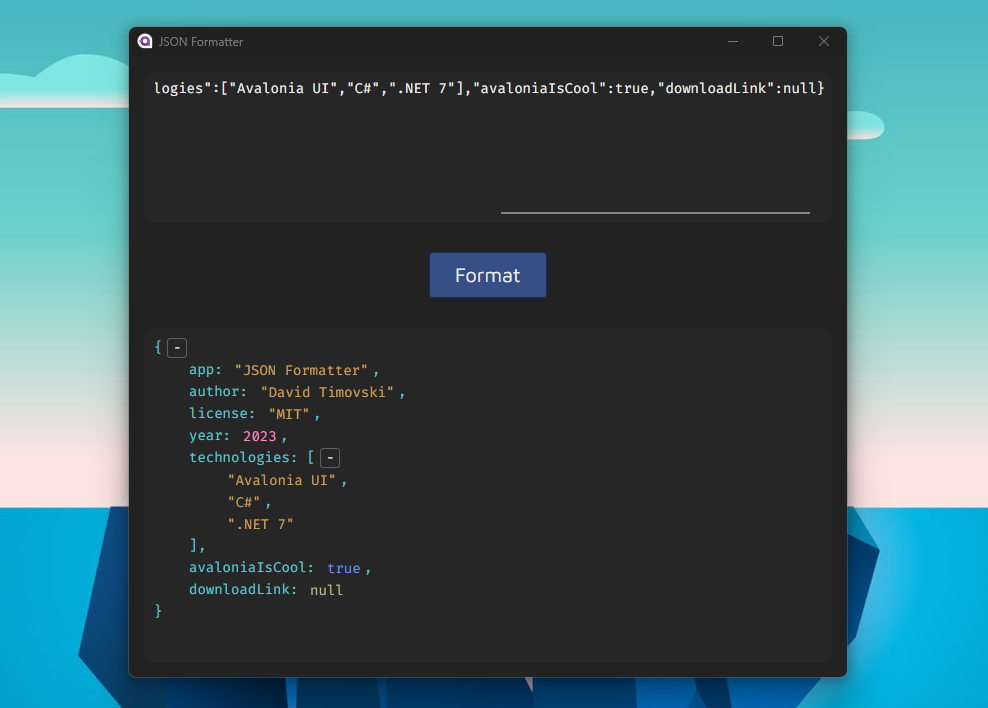

# JSON Formatter

A cross-platform desktop application for formatting JSON strings.

## How do I try it?

Build the project in Release mode and run the produced executable.

There is no installer to download because this app is not ready for prime time.
Large JSON objects render too many UI elements, making the formatting time annoyingly long and consuming way too much memory.

I don't blame Avalonia UI for this. This is just the type of app that requires custom optimization which I am not proficient enough to implement.
So until the performance and memory consumption issues are resolved I will not create downloadable installers for it.

## License

This project is licensed under the MIT License - see the [LICENSE](LICENSE) file for details.
